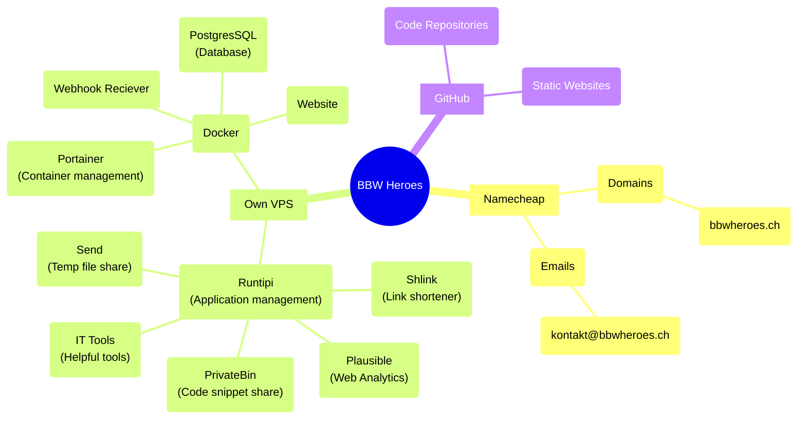

# Infrastructure

```mermaid
mindmap
    ((BBW Heroes))
        [Namecheap]
            (Domains)
                (bbwheroes.ch)
            (Emails)
                (kontakt@bbwheroes.ch)
        [Own VPS]
            ("Runtipi <br/> (Application management)")
                ("Send <br/> (Temp file share)")
                ("Plausible <br/> (Web Analytics)")
                ("PrivateBin <br/> (Code snippet share)")
                ("Shlink <br/> (Link shortener)")
                ("IT Tools <br/> (Helpful tools)")
            (Docker)
                ("Portainer <br/> (Container management)")
                (Website)
                (Webhook Reciever)
                ("PostgresSQL <br/> (Database)")
        [GitHub]
            (Code Repositories)
            (Static Websites)
            
```
